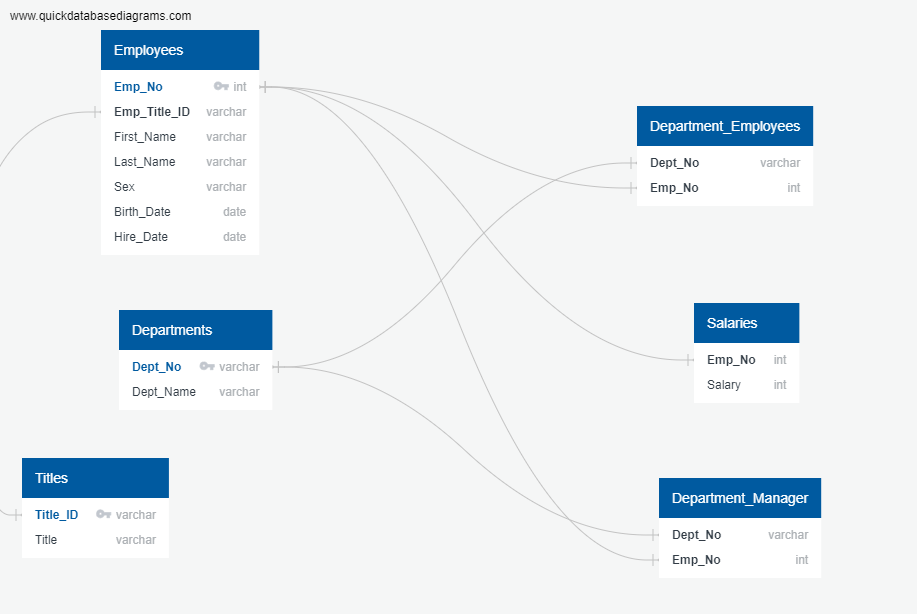

# Employee Database - Engineering and Analysis - SQL

- - -

I did data modeling, engineering and analysis on six different csv files using SQL.

- - -

## Background

There are six csv files that remain on the database of the employees between the 1980s and 1990s. I have been asked to
design the tables to hold data in the CSVs, import the CSVs into a SQL database, and answer questions about the data. 

## What I did:

#### Data Modeling

Inspected the CSVs and sketched out an ERD of the tables. I used [http://www.quickdatabasediagrams.com](http://www.quickdatabasediagrams.com) to sketch it out.

#### Data Engineering

* Used the information to create a table schema for each of the six CSV files.

* Imported each CSV file into the corresponding SQL table. 

#### Data Analysis

1. Listed the following details of each employee: employee number, last name, first name, sex, and salary.

2. Listed first name, last name, and hire date for employees who were hired in 1986.

3. Listed the manager of each department with the following information: department number, department name, the manager's employee number, last name, first name.

4. Listed the department of each employee with the following information: employee number, last name, first name, and department name.

5. Listed first name, last name, and sex for employees whose first name is "Hercules" and last names begin with "B."

6. Listed all employees in the Sales department, including their employee number, last name, first name, and department name.

7. Listed all employees in the Sales and Development departments, including their employee number, last name, first name, and department name.

8. In descending order, listed the frequency count of employee last names, i.e., how many employees share each last name.

- - -
The data is provided by UCSD Extension: Data Science and Visualization Bootcamp.
- - -

Contact:

Email: arcebri1@gmail.com